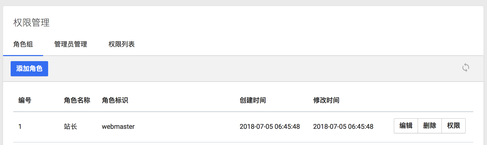

# 前端


为了加快开发系统提供了丰富的前端组件。

## 布局组件

### Tab



```
@component('components.tabs' ,['title'=>$role['title'].' 权限设置'])
    @slot('nav')
    <li class="nav-item"><a href="/admin/role" class="nav-link">角色组</a></li>
    <li class="nav-item"><a href="/admin/user" class="nav-link">管理员管理</a></li>
    <li class="nav-item"><a href="/admin/permission" class="nav-link">权限列表</a></li>
    @endslot

    @slot('header')
    <button data-toggle="modal" data-target="#add-role" type="button" class="btn btn-space btn-secondary">添加权限</button>
    @endslot

    @slot('body')
    @endslot
@endcomponent
```

