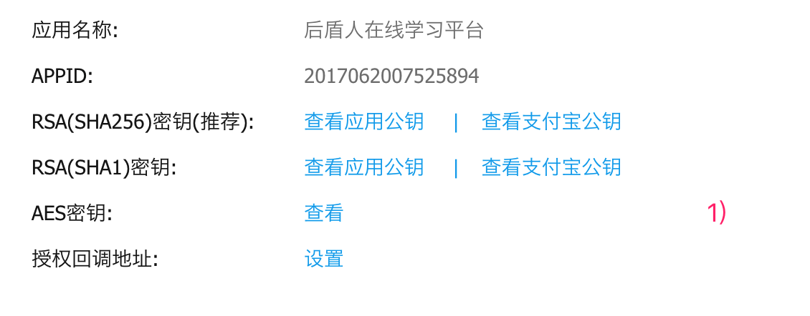
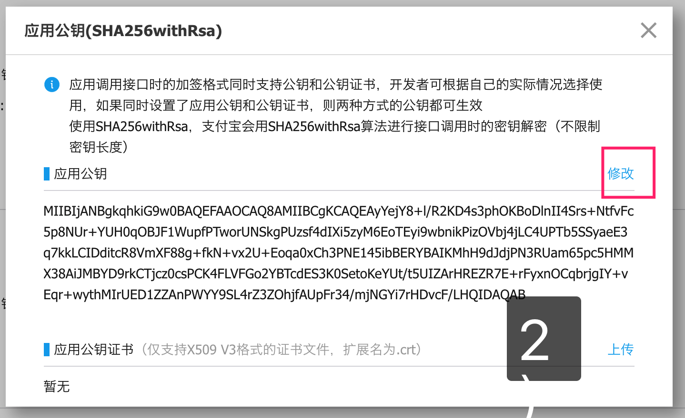
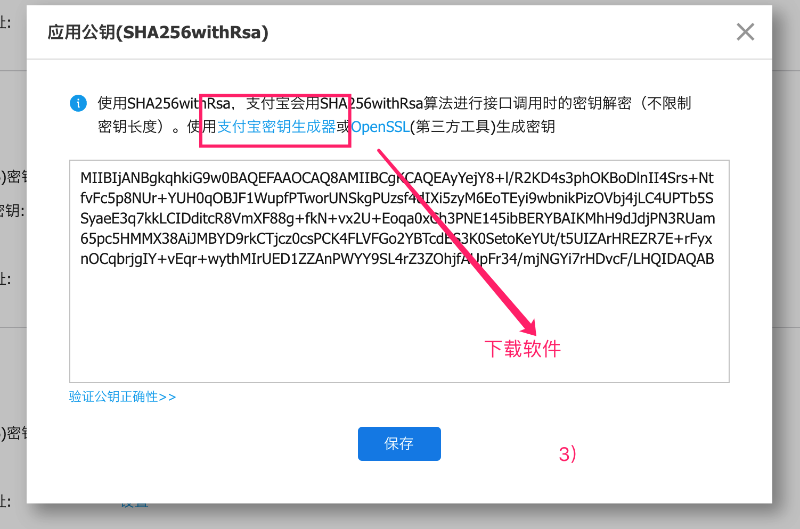
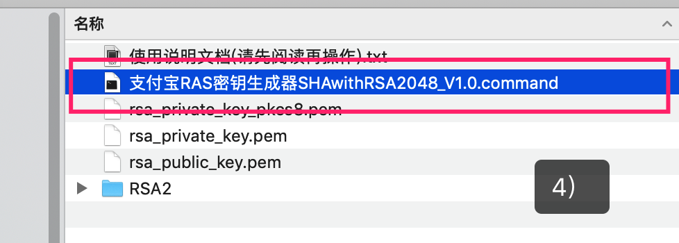
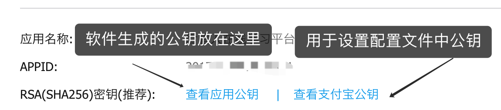

#支付宝

支付宝组件用于实现支付宝在线支付功能。

## 配置

获取密钥  https://openhome.alipay.com/platform/keyManage.htm












下载软件后执行 ` 支付宝RAS密钥生成器SHAwithRSA2048_V1.0.command` 命令生成密钥，生成的密钥会在软件目录中生成私钥与公钥。



### 程序中设置配置项

```
$config = [
    //应用ID,您的APPID。
    'app_id'               => "",

    //商户私钥，使用支付宝提供的签名生成工具创建
    'merchant_private_key' => "",

    //异步通知地址，不要有任何GET参数
    'notify_url'           => "http://www.houdunwang.com/notifyUrl",

    //同步跳转，不要有任何GET参数
    'return_url'           => "http://www.houdunwang.com/alip/returnUrl",

    //编码格式
    'charset'              => "UTF-8",

    //签名方式
    'sign_type'            => "RSA2",

    //支付宝网关
    'gatewayUrl'           => "https://openapi.alipay.com/gateway.do",

    //支付宝公钥,查看地址：https://openhome.alipay.com/platform/keyManage.htm 对应APPID下的支付宝公钥。使用支付宝提供的签名生成工具创建
    'alipay_public_key'    => "",
];
$pay = new \Houdunwang\Alipay\Alipay;
$pay->config($config);
```

## 发起支付
具体参数请参考 [支付宝开发文档](https://docs.open.alipay.com/270) 
```
$data = [
            //商户订单号，商户网站订单系统中唯一订单号，必填
            'WIDout_trade_no' => time(),
            //订单名称，必填
            'WIDsubject'      => '定单名称',
            //付款金额单位元，必填
            'WIDtotal_amount' => 0.01,
            //商品描述，可空
            'WIDbody'         => '定单描述',
];
$pay->PagePay($data);
```

## 通知处理

通知分同步通知与异步通知两种形式，同步通知用于为用户显示支付成功或失败的页面。异步通知用于修改定单状态。

#### 同步通知

```
$pay = new \Houdunwang\Alipay\Alipay;
$pay->config($config);
//签名验证
if($pay->signCheck()){
	//商户订单号
	$out_trade_no = htmlspecialchars($_GET['out_trade_no']);
	//支付宝交易号
	$trade_no = htmlspecialchars($_GET['trade_no']);
	echo "验证成功<br />支付宝交易号：".$trade_no;
}else{
	echo '支付失败';
}
```

#### 异步通知

```
$alipaySevice = new \AlipayTradeService($config);
$pay = new \Houdunwang\Alipay\Alipay;
$pay->config($config);
//签名验证
if ( ! $pay->signCheck()) {
	return 'fail';
}else{
	//商户订单号
        $out_trade_no = $_POST['out_trade_no'];
        //支付宝交易号
        $trade_no = $_POST['trade_no'];
        //交易状态
        $trade_status = $_POST['trade_status'];
        if ($_POST['trade_status'] == 'TRADE_FINISHED') {
            //支付成功时的业务处理
        } else if ($_POST['trade_status'] == 'TRADE_SUCCESS') {
            //交易完成时的业务处理
        }
        //必须返回以下内容给支付宝
        return 'success';
}
```