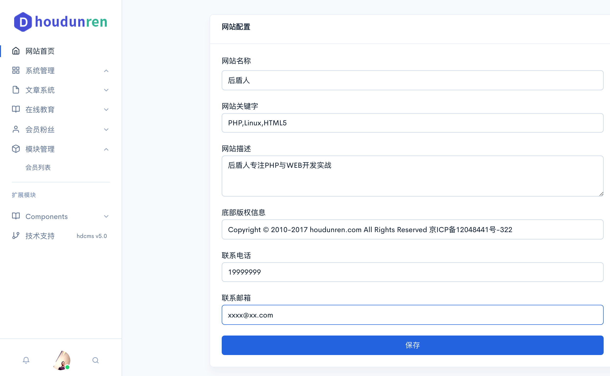

# HDCMS 5.0
基于Laravel 框架重构的PC、WAP、微信公众号、微信小程序多应用平台。

## 产品特点

* 全新的产品设计、快速的产品创新、超出用户期待的产品价值，基于微信/桌面/移动三网通设计模式为企业提供开发、运营、培训、推广一体化解决方案，帮助企业实现线上线下互通（O2O），社会化客户关系管理（SCRM），移动电商，轻应用（lightapp）WMAPP等多个层面的业务开发。

* 系统提供方便的二次开发机制，可根据自身业务需要快捷开发功能模块，并可将功能模块发布到应用商店进行二次获利。

* 完全免费使用的同时HDCMS不定期发布版本更新，不断推出让使用者惊喜的新功能，新模块。企业或个人也可以使用HDCMS做成云服务，让其他用户入住云应用，进行网站搭建与模块使用，企业只需要配置好相应套餐即可轻松营利。

## 软件截图

## 在线手册

官方提供了完善的帮助手册，便于开发者进行二次开发 
[查看手册](http://doc.hdcms.com/) 

## 官方网站
[http://www.hdcms.com](http://www.hdcms.com)

> 100% 免费使用于任何项目
